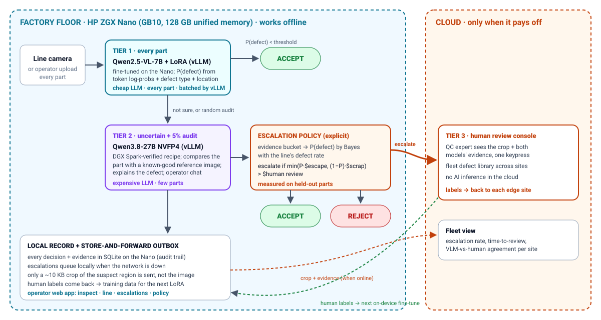

# NanoInspect

**Every part inspected on the line. Only the hard cases leave the building.**

NanoInspect is an edge-first visual quality-inspection system. It runs a cascade of **two locally served vision-language models** on one **HP ZGX Nano** (NVIDIA GB10), fine-tunes the cheaper one on the device, and escalates to a human in the cloud only when a cost rule says a review is worth it. When a part is rejected, it sends a machine-readable, SOP-grounded instruction to the line. HP Edge AI SJSUHack, September 2026.



## Who it is for, and why the cloud alone does not work
**Target user:** the QC line supervisor at a manufacturer launching a new product, who has about one second per part to decide: ship it, scrap it, or check it again.
- The product's images *are* its design, and the company does not want them in a vendor's cloud yet (**data residency**).
- A cloud round-trip eats the one-second budget (**latency**), and the line cannot stop when the WAN drops (**connectivity**).
- Cloud inference and human inspection both cost money for every part (**per-call cost**).
- Today's alternatives: human inspectors catch about 80–85% of defects and can reject a third of good parts ([Sandia, 2015](https://www.osti.gov/servlets/purl/1236203)); AQL sampling inspects only a sample of each lot; rule-based vision needs an engineer per product. Details in [docs/QA_FOR_JUDGES.md](docs/QA_FOR_JUDGES.md).

## The system
| Tier | Runs on | Model | Sees |
|---|---|---|---|
| 1 · cheap | ZGX Nano, vLLM :8001 | **Qwen2.5-VL-7B + LoRA fine-tuned on the Nano** (0.48% of weights, 28 min, real defect photos only) | every part: verdict, defect type, location, P(defect) from token log-probabilities |
| 2 · expensive | ZGX Nano, vLLM :8002 | **Qwen3.8-27B + LoRA fine-tuned on the Nano** (79.7M of 27.4B parameters, 0.29%, 2 h 14 min), chosen from the [vLLM recipes](https://recipes.vllm.ai) verified for DGX Spark / GB10; served as BF16 + adapter (`./serve_models.sh tier2ft`), or untrained NVFP4 (`tier2`) | parts tier 1 is unsure about, plus a 5% audit of accepts; compares with a known-good reference, explains, writes the NCR, answers operator chat |
| 3 · cloud | any server | a human reviewer (**no AI in the cloud**) | only parts where review is cheaper than the risk |

**Escalation rule (explicit, defensible, measurable).** Both tiers' answers put a part in an evidence bucket. Bayes' rule turns error rates measured on held-out parts, plus the line's defect rate, into P(defect | bucket). Then:
```
escalate  ⇔  min( P(defect) × $escaped_defect ,  P(good) × $scrapped_part )  >  $human_review
```
The rule is fitted on one half of the evaluation images and reported on the other. The costs are editable in the app.

**Also on the edge:**
- An explicit **delta map**: per-patch distance to ~40 known-good parts. It is training-free and gives a heatmap.
- An input check for broken camera frames.
- A **SOP library** (`config/sop.json`, ISO 9001 §8.7) and **machine JSON** for the PLC / MES: divert, NCR, containment, and stop-line when a defect repeats.
- A store-and-forward outbox: only a crop of an escalated part is sent, and it queues through outages.
- Human labels flow back as training data.

## Baselines
Classical ResNet-18 classifier · training-free delta · zero-shot Qwen2.5-VL-7B · zero-shot Qwen3.8-27B · a human checks every part · tier 1 alone · tier 2 alone. All are evaluated on the same 1,096 held-out MVTec AD images (15 products, 73 real defect types).

## Results
All numbers are measured on the ZGX Nano, on the same 1,096 held-out images (629 defective, 467 good) that no model trained on.

**Every model against the baselines** (tier 2 before → after its LoRA fine-tune on the Nano):

| Model | ROC-AUC | Defects caught | Good parts flagged | Right defect type | Right location |
|---|---|---|---|---|---|
| **Tier 1: Qwen2.5-VL-7B + LoRA (ours)** | **0.962** | **84.4%** | **5.6%** | **73.6%** | **70.6%** |
| **Tier 2: Qwen3.8-27B + LoRA + good reference (ours)** | 0.956 → **0.988** | 89.2% → **94.3%** | 11.1% → **4.7%** | 54.0% → **78.1%** | 65.6% → **80.8%** |
| Baseline: Qwen2.5-VL-7B zero-shot | 0.837 | 20.8% | 1.7% | 52.7% | 48.1% |
| Baseline: Qwen3.8-27B zero-shot, single image | 0.924 | 74.7% | 7.7% | 51.3% | 64.3% |
| Baseline: ResNet-18 classifier (not an LLM) | 0.960 | 92.8% | 14.8% | – | – |
| Baseline: training-free difference map (not an LLM) | 0.892 | 62.5% | 4.1% | – | – |

**Whole strategies, per 1,000 parts** (held-out half; $50 per escaped defect, $2 per scrapped good part, $0.50 per human review; 5% defect rate):

| Strategy | Cost | Escaped defects | Good parts scrapped | Human reviews | Tier-2 calls |
|---|---|---|---|---|---|
| **NanoInspect, capacity mode** (tier 2 on as many parts as it can serve) | **$230** | 3.9 | 0 | 73 | 524 |
| Tier 2 alone (fine-tuned 27B decides every part) | $217 | 3.0 | 34.1 | 0 | 1,000 (too slow for the line: 0.46 parts/s) |
| **NanoInspect, throughput mode (default)** | **$412** | 7.2 | 11.4 | 56 | 151 |
| ResNet-18 alone | $445 | 3.8 | 128.7 | 0 | – |
| A person checks every part | $500 | 0 | 0 | 1,000 | – |
| Tier 1 alone | $505 | 7.5 | 64.3 | 0 | – |
| 27B zero-shot alone | $778 | 12.5 | 75.7 | 0 | – |

**Tier-2 fine-tune decision:** the rule set before training was to keep it only if the cascade cost per 1,000 parts beat the baseline's $415.24. It came in at $411.91, so we **kept** it (`02_tier2_finetune_and_capacity.ipynb`; the baseline is tagged `pre-tier2-finetune`). The price: the adapter needs the BF16 weights, so tier 2 serves 0.46 parts/s instead of 0.95 with NVFP4, and uses 122 J per call instead of 51.

**Edge performance (fine-tuned setup):**

| Metric | Result |
|---|---|
| Soak test, 15 min, both tiers | 2,671 + 180 inferences, max 70 °C, no throttling, 0 errors |
| Energy per inspection (GPU) | tier 1 13.7 J · tier 2 122.2 J |
| Offline (network blocked) | 3/3 full inspections, 0 outbound connections |
| Failure cases | 9 tested, 0 broken inputs accepted |
| Cloud API cost avoided (60 parts/min, 16 h) | ≈ $89/day, 30M tokens, 66,000 calls (GPT-4o-equivalent rates) |

See [METRICS.md](METRICS.md) for how and why each metric was chosen. The full numbers are in `artifacts/results/benchmark_summary.json`.

## Run it on a ZGX Nano
```bash
git clone <this repo> && cd nanoinspect && ./setup.sh     # venv, packages, model weights (then works offline)
export NANOINSPECT_DATA=$HOME/Downloads/mvtec_anomaly_detection   # MVTec AD, CC BY-NC-SA 4.0
./serve_models.sh tier1 && ./serve_models.sh tier2ft   # 7B + LoRA on :8001, fine-tuned 27B on :8002 (or 'both' for the untrained NVFP4 27B)
./run_cloud.sh &              # cloud review tier :9000 (or: docker build -f cloud/Dockerfile -t nanoinspect-cloud .)
./run_edge.sh                 # operator app :8080
jupyter nbconvert --to notebook --execute --inplace nanoinspect.ipynb    # all evaluations, serving benchmark, stress tests
```
From a laptop: `ssh -L 8080:localhost:8080 -L 9000:localhost:9000 <user>@<nano-ip>`, then open
- http://localhost:8080: operator console (overview, inspect with upload or webcam + chat, production line + line controller, cloud escalations, models and serving metrics, escalation policy and cost, evidence)
- http://localhost:8080/pitch: interactive pitch with live numbers
- http://localhost:9000: cloud review console

The LoRA adapter (160 MB) is too large for git; publish it as a release or on Hugging Face and set `ADAPTER_REPO` for `setup.sh`, or retrain with `nanoinspect/vlm.py` (section 3 of the notebook).

## Repository
| Path | What |
|---|---|
| `nanoinspect.ipynb` | Model choice, fine-tune record, quality vs baselines, serving benchmark, escalation policy, machine JSON, stress tests, line simulation |
| `nanoinspect/serving.py`, `cascade.py` | Clients for the vLLM tiers; the per-part cascade |
| `nanoinspect/vlm.py` | LoRA fine-tuning of Qwen2.5-VL-7B on the Nano |
| `nanoinspect/policy.py` | Cost-based escalation policy |
| `nanoinspect/delta.py` | Training-free delta map |
| `nanoinspect/actions.py`, `config/sop.json` | SOP-grounded machine instructions |
| `nanoinspect/escalation.py`, `cloud/` | Edge outbox and store-and-forward; cloud review service + Dockerfile |
| `nanoinspect/server.py`, `nanoinspect/web/` | Edge web app and pitch |
| `nanoinspect/stress_llm.py`, `linesim.py`, `telemetry.py` | Soak, energy, robustness, offline, failure tests; line simulator; GPU telemetry |
| `nanoinspect/vision.py`, `defects.py` | ResNet-18 baseline and its synthetic defects |
| `serve_models.sh`, `run_edge.sh`, `run_cloud.sh`, `setup.sh` | Scripts |
| `docs/` | Architecture, Q&A for judges, demo and video script, vLLM recipe snapshot |

## Rules compliance
All inference, training and fine-tuning run on the ZGX Nano with open-weight models (Qwen2.5-VL-7B-Instruct: Apache 2.0; nvidia/Qwen3.8-27B-NVFP4: Apache 2.0). The cloud tier runs no AI. The offline proof blocks every outbound connection while full inspections run (notebook section 8).

## Limits
MVTec AD is a public benchmark, not a production line. The default costs and the SOP are illustrative, and the cloud tier runs on our own machine in the demo.
